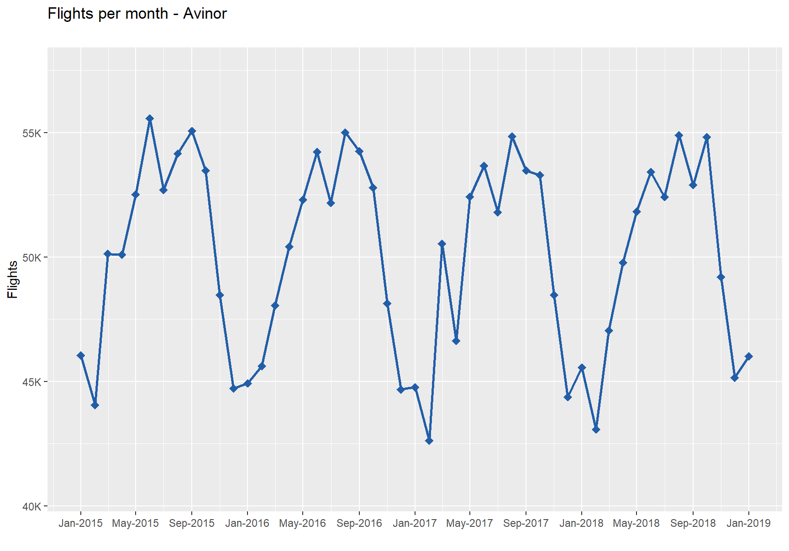
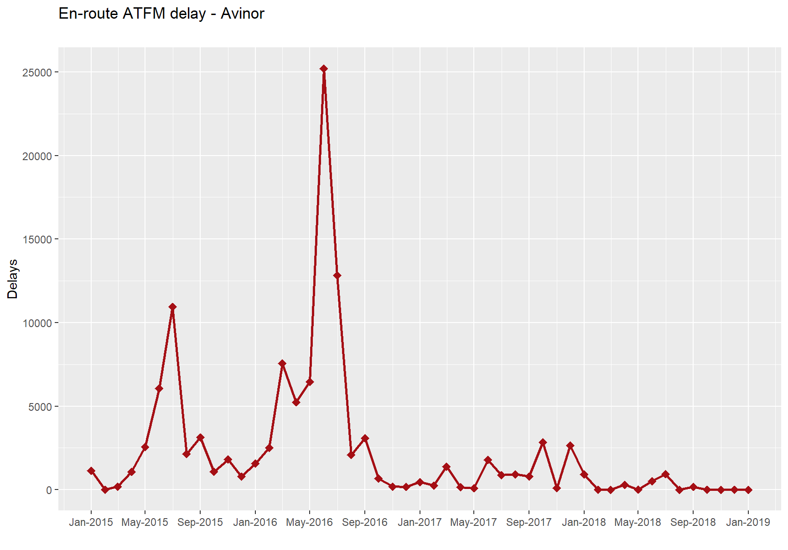
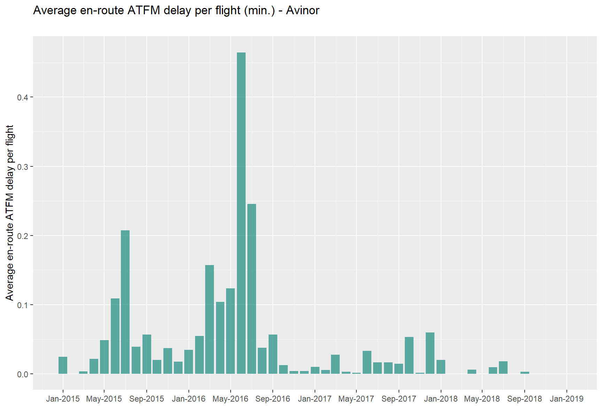
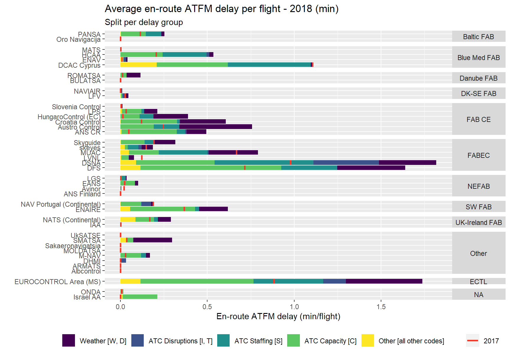
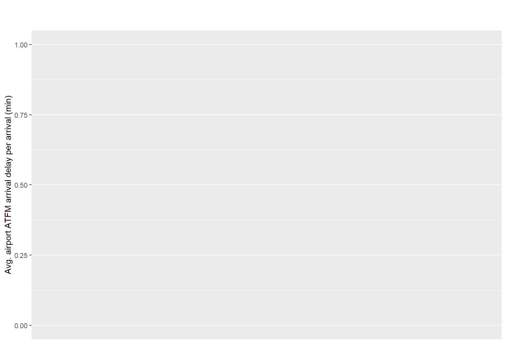

---
output:
  pdf_document: default
  html_document: default
editor_options: 
  chunk_output_type: console
---

# Capacity

## Air traffic flow management (ATFM) delays

Source : NM, PRU ANS Performance Data Portal  
         The data in this section is from the PRU ANS performance data portal (data section).  
         It is available at: <http://ansperformance.eu/data/performancearea/>

### En-route ATFM delays

(ref:flights) Flights (Avinor). 

(\#fig:flights)(ref:flights)

(ref:delay) En-route ATFM delay (Avinor). 

(\#fig:delay)(ref:delay)

(ref:avg-dly-flt) Average en-route ATFM delay per flight (Avinor). 

(\#fig:avg-dly-flt)(ref:avg-dly-flt)

(ref:average-delay-grouped) Average en route ATFM delay per flight (EUROCONTROL area). 

(\#fig:average-delay-grouped)(ref:average-delay-grouped)

### Airport arrival ATFM delays

(ref:avg-arriv-delay) Airport arrival ATFM delays (Bergen). 

(\#fig:avg-arriv-delay)(ref:avg-arriv-delay)

(ref:avg-daily-arr) Airport arrival ATFM delays (Bergen). 

(\#fig:avg-daily-arr)(ref:avg-daily-arr)

