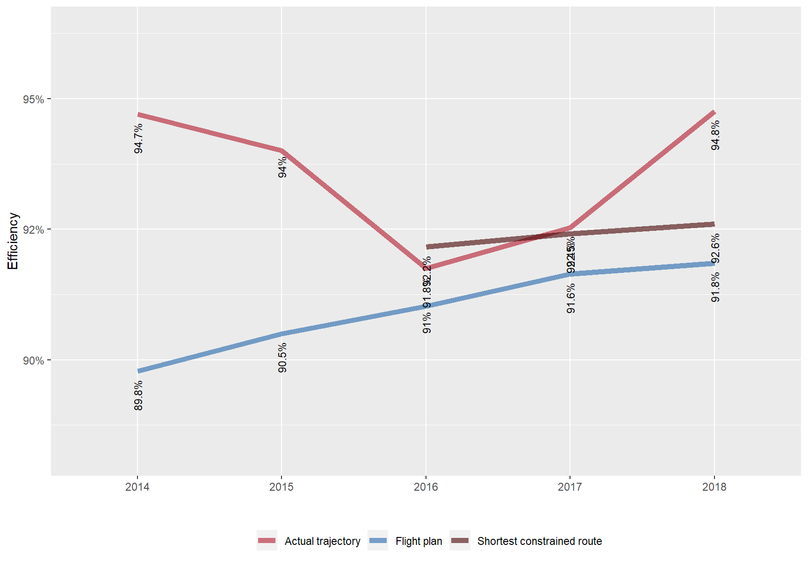
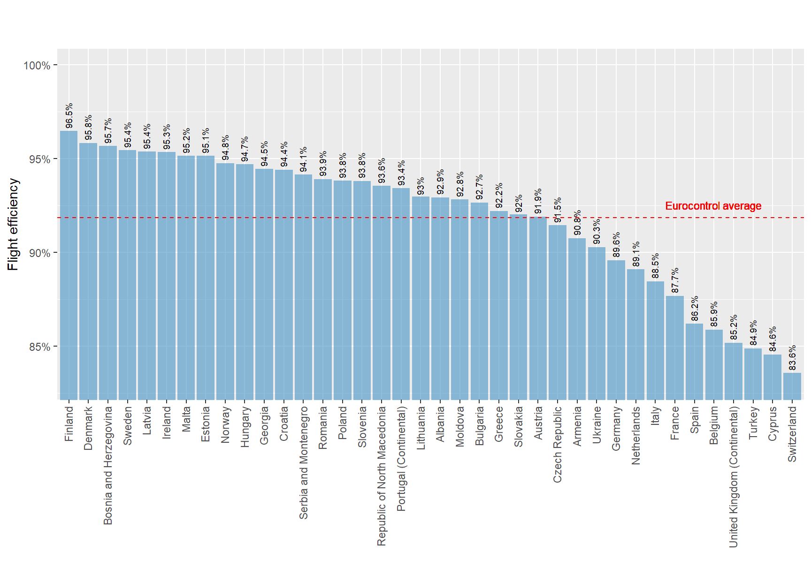
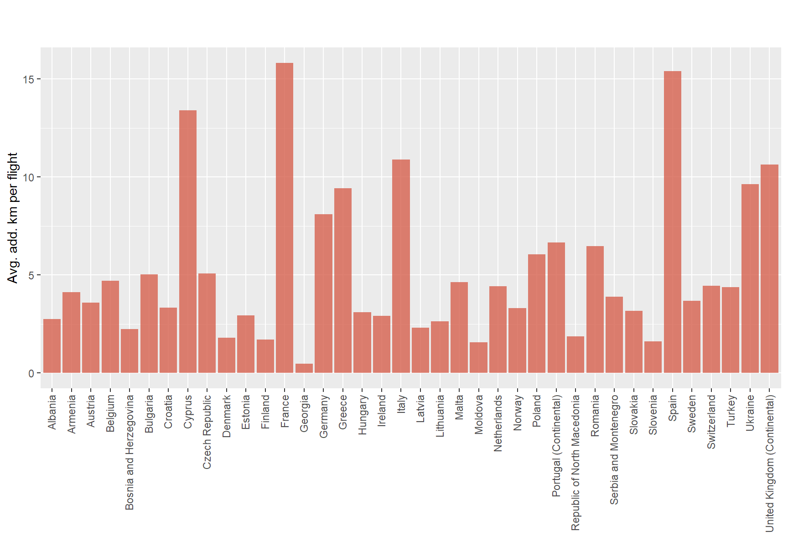
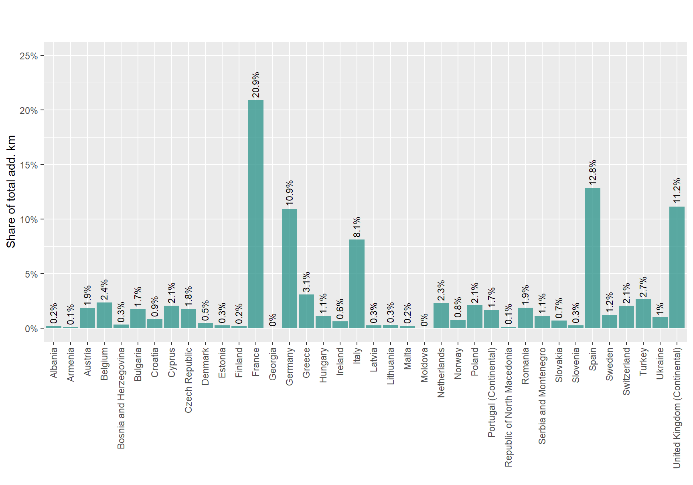
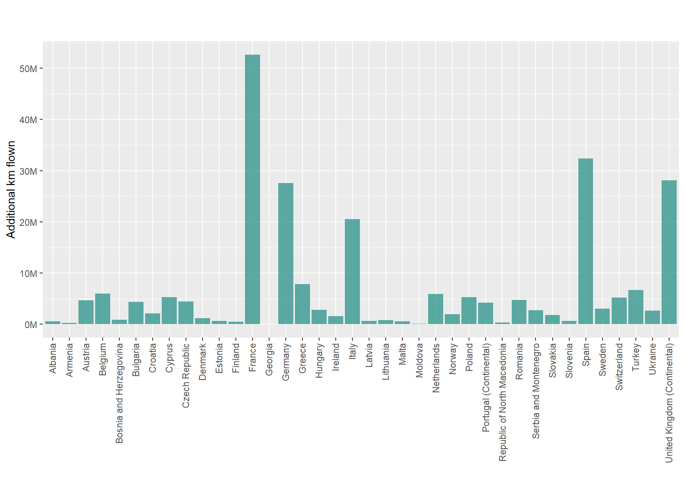

# Environment 

Source : PRU ANS Performance Data Portal 
         The data in this section is from the PRU ANS performance data portal (data section).  
         It is available at: <http://ansperformance.eu/data/performancearea/>

## Horizontal flight efficiency

(ref:hfe-year) Horizontal en-route flight efficiency - (Norway). 

(\#fig:hfe-year)(ref:hfe-year)

(ref:hfe-daily) Horizontal en-route flight efficiency - (Norway). 

(\#fig:hfe-daily)(ref:hfe-daily)

(ref:flt-eff) Horizontal en-route flight efficiency by State (actual trajectories - 2018). 

(\#fig:flt-eff)(ref:flt-eff)

- Horizontal en-route flight efficiency (actual trajectory) was  91.9% 
in the EUROCONTROL area in 2018. 

(ref:avg-add) Horizontal en-route flight efficiency by State (actual trajectories - 2018). 

(\#fig:avg-add)(ref:avg-add)

(ref:tot-share) Horizontal en-route flight efficiency by State (actual trajectories - 2018). 

(\#fig:tot-share)(ref:tot-share)

(ref:add-flown) Horizontal en-route flight efficiency by State (actual trajectories - 2018). 

(\#fig:add-flown)(ref:add-flown)

